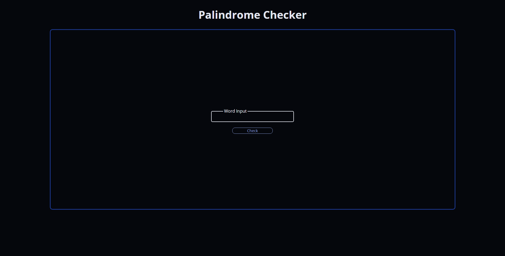
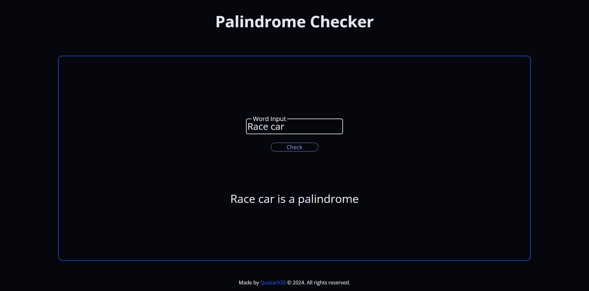
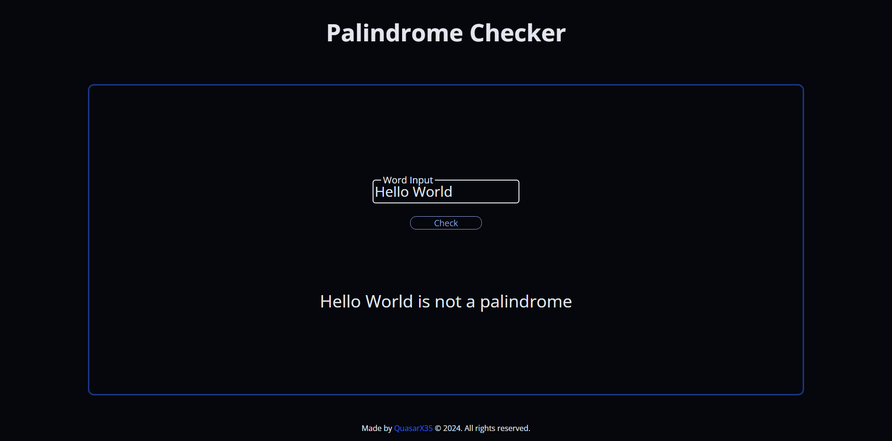

# Palindrome Checker Website
This is a simple web application built to check whether a given string or number is a palindrome. It was created as a certification project for the FreeCodeCamp Javascript course.

## Features
- Checks for palindromes in both strings and numbers.
- Handles complex strings by removing special characters before checking.
- Provides clear user feedback indicating if the input is a palindrome or not.

## Technologies Used
- HTML: for structuring the website content.
- CSS: for styling the website layout and elements.
- JavaScript: for handling user interaction and palindrome checking logic.

## Running the Application
- Clone this repository to your local machine.
- Open the index.html file in your web browser.
- Enter a string or number in the input field.
- Click the "Check" button.

The application will display a message indicating whether the input is a palindrome or not.

## Screenshots

View the FreeCodeCamp challenge [here](https://www.freecodecamp.org/learn/javascript-algorithms-and-data-structures-v8/build-a-palindrome-checker-project/build-a-palindrome-checker).